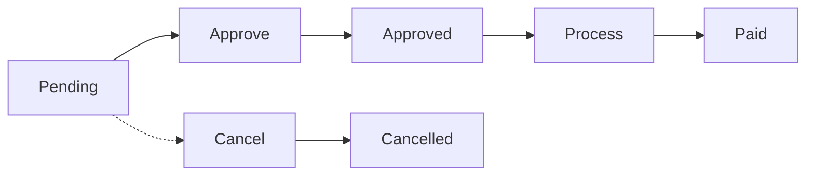

# Payment Voucher Management - Complete Feature Guide

## 📋 Overview

Version 8 introduces comprehensive payment voucher management with role-based approval workflows, detailed modal views, commitment tracking, and professional PDF generation.

---

## 🆕 New Features

### 1. ✅ Payment Voucher Creation Dialog

**Component**: `CreatePaymentVoucherDialog.tsx`

A comprehensive form for creating payment vouchers with:
- **Commitment Selection**: Choose from open/partial commitments
- **Supplier/Payee Selection**: Auto-fills bank details
- **Payment Method**: EFT, Cheque, or Cash
- **Amount Validation**: Prevents exceeding commitment balance
- **Real-time Form Validation**: Comprehensive error checking
- **Auto-fill Features**: Remaining balance, bank details

#### Usage

```tsx
import { CreatePaymentVoucherDialog } from "@/components/payments/CreatePaymentVoucherDialog";

function PaymentsPage() {
  const [dialogOpen, setDialogOpen] = useState(false);

  return (
    <>
      <Button onClick={() => setDialogOpen(true)}>
        New Payment Voucher
      </Button>

      <CreatePaymentVoucherDialog
        open={dialogOpen}
        onOpenChange={setDialogOpen}
        onSuccess={() => {
          // Reload payments list
          loadPayments();
        }}
      />
    </>
  );
}
```

#### Form Fields

| Field | Required | Validation | Auto-fill |
|-------|----------|-----------|-----------|
| Commitment | Yes | Must select valid commitment | - |
| Supplier/Payee | Yes | Must select from list | Bank details |
| Amount | Yes | > 0, ≤ remaining balance | Remaining amount |
| Payment Date | Yes | Valid date | - |
| Payment Method | Yes | EFT/Cheque/Cash | - |
| Bank Name | EFT only | Required for EFT | From supplier |
| Account Number | EFT only | Required for EFT | From supplier |
| Description | Yes | Min 10 characters | - |

#### Validation Rules

```typescript
// Amount validation
if (parseFloat(amount) > commitment.remaining_amount) {
  error = "Amount cannot exceed remaining commitment balance";
}

// Description validation
if (description.trim().length < 10) {
  error = "Please provide a description (minimum 10 characters)";
}

// Bank details validation (for EFT)
if (paymentMethod === "EFT" && !bankName) {
  error = "Bank name is required for EFT payments";
}
```

---

### 2. ✅ Payment Detail Modal

**Component**: `PaymentDetailModal.tsx`

Comprehensive payment voucher details with:
- **Full Voucher Information**: All payment details
- **Approval History**: Timeline of actions
- **Role-based Actions**: Approve/Process buttons
- **PDF Generation**: Print voucher/receipt
- **Status Tracking**: Visual status badges

#### Usage

```tsx
import { PaymentDetailModal } from "@/components/payments/PaymentDetailModal";

function PaymentsTable() {
  const [selectedPaymentId, setSelectedPaymentId] = useState<number | null>(null);
  const [modalOpen, setModalOpen] = useState(false);

  return (
    <>
      <Button onClick={() => {
        setSelectedPaymentId(payment.id);
        setModalOpen(true);
      }}>
        View Details
      </Button>

      <PaymentDetailModal
        paymentId={selectedPaymentId}
        open={modalOpen}
        onOpenChange={setModalOpen}
        onUpdate={() => {
          // Reload payments after approval/processing
          loadPayments();
        }}
      />
    </>
  );
}
```

#### Role-Based Actions

| Role | Can View | Can Approve | Can Process |
|------|----------|-------------|-------------|
| System Admin | ✅ All | ✅ Yes | ✅ Yes |
| Bursar | ✅ All | ✅ Yes | ❌ No |
| Bursary Clerk | ✅ All | ❌ No | ✅ Yes |
| Budget Officer | ✅ All | ❌ No | ❌ No |
| Requestor | ✅ Own | ❌ No | ❌ No |

#### Approval Workflow



**Approve Payment** (Bursar role):
```typescript
async function handleApprove() {
  const { data: { user } } = await supabase.auth.getUser();
  await approvePaymentVoucher(payment.id, user.id);
  // Status changes from "Pending" to "Approved"
}
```

**Process Payment** (Bursary Clerk role):
```typescript
async function handleProcess() {
  const { data: { user } } = await supabase.auth.getUser();
  await processPayment(
    payment.id,
    user.id,
    bankReference,  // For EFT
    chequeNumber    // For Cheque
  );
  // Status changes to "Paid"
  // Commitment status updated
  // GE request marked as paid
}
```

---

### 3. ✅ Commitment Detail Page

**Page**: `/dashboard/commitments/[id]/page.tsx`

Detailed commitment view with:
- **Commitment Information**: Full details
- **Financial Summary**: Amount breakdown
- **Payment History**: All related payments
- **Activity Timeline**: Chronological events
- **Utilization Tracking**: Visual progress bar

#### Features

**Summary Cards**:
- Total Commitment
- Total Paid (with %)
- Remaining Balance
- Number of Payments

**Payment History Table**:
- Voucher number
- Payee name
- Amount
- Payment method
- Payment date
- Status
- Reference number

**Activity Timeline**:
- Commitment creation
- Each payment processed
- Commitment closure

#### Navigation

```tsx
// From commitments list
<Button onClick={() => router.push(`/dashboard/commitments/${commitment.id}`)}>
  <Eye className="h-4 w-4" />
</Button>

// Direct URL
/dashboard/commitments/123
```

---

### 4. ✅ PDF Generation

**Utility**: `pdf-generator.ts`

Professional PDF generation for:
- Payment Vouchers
- Payment Receipts
- Payment Registers

#### Payment Voucher PDF

```typescript
import { generatePaymentVoucherPDF } from "@/lib/pdf-generator";

function handlePrintVoucher() {
  generatePaymentVoucherPDF({
    voucher_number: "PV-2025-000123",
    payee_name: "Brian Bell Ltd",
    amount: 15000,
    payment_method: "EFT",
    // ... other fields
  });
  // Downloads: Payment_Voucher_PV-2025-000123.pdf
}
```

**Voucher Includes**:
- ✅ UNRE Header with branding
- ✅ Voucher number & status badge
- ✅ GE request & commitment details
- ✅ Payee information
- ✅ Payment method details
- ✅ Description
- ✅ Approval history table
- ✅ Signature boxes (Prepared, Approved, Received)
- ✅ System footer with timestamp

#### Payment Receipt PDF

```typescript
import { generatePaymentReceiptPDF } from "@/lib/pdf-generator";

function handleDownloadReceipt() {
  if (payment.status !== "Paid") {
    toast.error("Receipt can only be generated for paid vouchers");
    return;
  }

  generatePaymentReceiptPDF({
    voucher_number: "PV-2025-000123",
    payee_name: "Brian Bell Ltd",
    amount: 15000,
    // ... other fields
  });
  // Downloads: Payment_Receipt_PV-2025-000123.pdf
}
```

**Receipt Includes**:
- ✅ UNRE Header
- ✅ Large amount display box
- ✅ Receipt details table
- ✅ Payment description
- ✅ Authorized signature section
- ✅ "Computer-generated" disclaimer
- ✅ System footer

#### Multiple Payments Register

```typescript
import { generateMultiplePaymentsPDF } from "@/lib/pdf-generator";

function handleExportRegister() {
  generateMultiplePaymentsPDF(paymentsArray);
  // Downloads: Payment_Register_2025-01-25.pdf
}
```

**Register Includes**:
- ✅ UNRE Header
- ✅ Report date & total payments
- ✅ Summary total amount
- ✅ Table of all payments
- ✅ Voucher #, Payee, Amount, Method, Date, Status

---

## 🔄 Complete Workflow Example

### Creating and Processing a Payment

**Step 1: Create Payment Voucher**
```typescript
// User clicks "New Payment Voucher"
// Selects commitment: COM-2025-000045 (K 45,000 remaining)
// Selects supplier: Brian Bell Ltd
// Amount: K 45,000 (auto-filled)
// Payment date: 2025-01-25
// Method: EFT
// Bank: Bank South Pacific (auto-filled)
// Account: 1234567890 (auto-filled)
// Description: "Payment for office furniture as per quote #12345"
// Clicks "Create Payment Voucher"

// Result: PV-2025-000123 created with status "Pending"
```

**Step 2: Approve Payment** (Bursar)
```typescript
// Bursar opens payment details
// Reviews:
//   - Amount: K 45,000
//   - Payee: Brian Bell Ltd
//   - Commitment has sufficient balance
//   - Description is clear
// Clicks "Approve Payment"

// Result: Status changes to "Approved"
// Audit log: "Approved by Emmanuel Saliki at 2025-01-25 10:30 AM"
```

**Step 3: Process Payment** (Bursary Clerk)
```typescript
// Bursary Clerk opens payment details
// Clicks "Process Payment"
// Enters bank reference: EFT20250125-001
// Clicks "Confirm Payment"

// Result:
// - Payment status → "Paid"
// - Commitment remaining_amount → K 0
// - Commitment status → "Closed"
// - GE request status → "paid"
// - Audit log created
```

**Step 4: Generate Receipt**
```typescript
// User clicks "Receipt PDF"
// System generates professional receipt
// Downloads automatically
```

---

## 🔐 Security & Authorization

### Role Checks

```typescript
// Check user role before showing actions
async function checkUserRole() {
  const { data: roles } = await supabase
    .from("user_roles")
    .select("roles(name)")
    .eq("user_id", user.id);

  const roleNames = roles.map(r => r.roles.name);

  if (roleNames.includes("Bursar") || roleNames.includes("System Admin")) {
    // Can approve payments
    setUserRole("approver");
  } else if (roleNames.includes("Bursary Clerk")) {
    // Can process payments
    setUserRole("processor");
  }
}
```

### Permission Matrix

| Action | System Admin | Bursar | Bursary Clerk | Others |
|--------|--------------|--------|---------------|--------|
| Create Voucher | ✅ | ✅ | ✅ | ❌ |
| View Details | ✅ | ✅ | ✅ | Own only |
| Approve | ✅ | ✅ | ❌ | ❌ |
| Process | ✅ | ❌ | ✅ | ❌ |
| Cancel | ✅ | ✅ | ❌ | ❌ |
| Generate PDF | ✅ | ✅ | ✅ | Own only |

---

## 📊 Data Flow

### Payment Creation Flow

```
1. User opens CreatePaymentVoucherDialog
2. System loads:
   - Open/Partial commitments from database
   - Active suppliers from database
3. User selects commitment
   - Auto-fills remaining amount
4. User selects supplier
   - Auto-fills bank details (if EFT)
5. User fills other fields
6. System validates:
   - All required fields present
   - Amount ≤ remaining balance
   - Description length ≥ 10 chars
7. On submit:
   - Generate voucher number (PV-YYYY-XXXXXX)
   - Insert payment_voucher record
   - Create audit log entry
8. Success notification
9. Refresh payments list
```

### Approval/Processing Flow

```
1. User opens PaymentDetailModal
2. System loads:
   - Payment voucher details
   - GE request info
   - Commitment info
   - Approval history
3. System checks user role
4. Shows appropriate action buttons
5. On approve/process:
   - Update payment_voucher status
   - Update commitment (if processing)
   - Update GE request (if processing)
   - Create audit log
6. Success notification
7. Refresh data
```

---

## 🎨 UI/UX Features

### Form Validation

**Visual Feedback**:
- ✅ Red border on invalid fields
- ✅ Error icon with message
- ✅ Character counter for description
- ✅ Disabled submit until valid

**Real-time Validation**:
```typescript
// Amount validation on change
onChange={(e) => {
  setAmount(e.target.value);
  if (parseFloat(e.target.value) > remainingBalance) {
    setErrors(prev => ({
      ...prev,
      amount: "Amount exceeds remaining balance"
    }));
  }
}}
```

### Status Badges

Color-coded status indicators:

| Status | Color | Background |
|--------|-------|------------|
| Paid | Green | `bg-green-100 text-green-800` |
| Approved | Blue | `bg-blue-100 text-blue-800` |
| Pending | Yellow | `bg-yellow-100 text-yellow-800` |
| Cancelled | Red | `bg-red-100 text-red-800` |

### Loading States

```tsx
{loading ? (
  <div className="flex items-center justify-center py-12">
    <Loader2 className="h-8 w-8 animate-spin text-unre-green-600" />
  </div>
) : (
  // Content
)}
```

### Success Notifications

```typescript
toast.success("Payment voucher created successfully!");
toast.success("Payment voucher approved!");
toast.success("Payment processed successfully!");
toast.success("PDF generated!");
```

---

## 📱 Responsive Design

All components are fully responsive:

**Mobile** (< 768px):
- Single column layouts
- Collapsible sections
- Touch-friendly buttons
- Scrollable tables

**Tablet** (768px - 1024px):
- Two-column layouts
- Compact tables
- Medium-sized modals

**Desktop** (> 1024px):
- Multi-column layouts
- Full-width tables
- Large modals with details

---

## 🧪 Testing Scenarios

### Test Payment Creation

1. Create commitment with K 50,000
2. Create payment voucher for K 30,000
3. Verify:
   - ✅ Voucher created with "Pending" status
   - ✅ Commitment still shows K 50,000 remaining
   - ✅ Voucher number follows pattern PV-YYYY-XXXXXX

### Test Approval Workflow

1. Login as Bursar
2. Open pending payment
3. Click "Approve Payment"
4. Verify:
   - ✅ Status changes to "Approved"
   - ✅ Approver name recorded
   - ✅ Audit log created
   - ✅ Cannot approve again

### Test Payment Processing

1. Login as Bursary Clerk
2. Open approved payment
3. Enter bank reference
4. Click "Confirm Payment"
5. Verify:
   - ✅ Payment status → "Paid"
   - ✅ Commitment updated (K 50,000 - K 30,000 = K 20,000)
   - ✅ Commitment status → "Partial"
   - ✅ GE request status updated

### Test PDF Generation

1. Open paid payment
2. Click "Print Voucher"
3. Verify:
   - ✅ PDF downloads
   - ✅ Contains UNRE branding
   - ✅ Shows correct amount
   - ✅ All details present

4. Click "Receipt PDF"
5. Verify:
   - ✅ Receipt PDF downloads
   - ✅ Shows "Paid" clearly
   - ✅ Different format from voucher

---

## ⚙️ Configuration

### PDF Styling

Modify UNRE green color in PDFs:

```typescript
// In pdf-generator.ts
doc.setFillColor(22, 163, 74); // UNRE Green #16a34a
```

### Validation Rules

Adjust minimum description length:

```typescript
// In CreatePaymentVoucherDialog.tsx
if (description.trim().length < 10) {  // Change 10 to desired length
  newErrors.description = "Please provide a description (minimum 10 characters)";
}
```

### Auto-fill Behavior

Disable auto-fill of remaining amount:

```typescript
// Remove this useEffect
useEffect(() => {
  if (selectedCommitment) {
    const commitment = commitments.find((c) => c.id.toString() === selectedCommitment);
    if (commitment && commitment.remaining_amount) {
      setAmount(commitment.remaining_amount.toString());  // Remove this line
    }
  }
}, [selectedCommitment, commitments]);
```

---

## 🐛 Troubleshooting

### Issue: "Failed to load commitments"

**Cause**: Database connection or RLS policies

**Solution**:
```sql
-- Check if user can read commitments
SELECT * FROM commitments
WHERE status IN ('Open', 'Partial')
LIMIT 1;

-- If empty, check RLS policies
SELECT * FROM commitments LIMIT 1;
```

### Issue: "Amount exceeds remaining balance"

**Cause**: Commitment already has payments

**Solution**:
1. Check commitment detail page
2. View existing payments
3. Calculate actual remaining balance
4. Adjust payment amount

### Issue: PDF not downloading

**Cause**: Browser popup blocker or jsPDF error

**Solution**:
```typescript
// Add try-catch with detailed error
try {
  generatePaymentVoucherPDF(data);
  toast.success("PDF generated!");
} catch (error) {
  console.error("PDF Error:", error);
  toast.error(`Failed to generate PDF: ${error.message}`);
}
```

---

## 📚 API Reference

### CreatePaymentVoucherDialog Props

```typescript
interface CreatePaymentVoucherDialogProps {
  open: boolean;                    // Control dialog visibility
  onOpenChange: (open: boolean) => void;  // Handle dialog state
  onSuccess?: () => void;          // Callback after successful creation
}
```

### PaymentDetailModal Props

```typescript
interface PaymentDetailModalProps {
  paymentId: number | null;        // ID of payment to display
  open: boolean;                   // Control modal visibility
  onOpenChange: (open: boolean) => void;  // Handle modal state
  onUpdate?: () => void;          // Callback after approval/processing
}
```

### PDF Generator Functions

```typescript
// Payment Voucher
generatePaymentVoucherPDF(payment: PaymentVoucherData): void

// Payment Receipt
generatePaymentReceiptPDF(payment: PaymentVoucherData): void

// Payment Register
generateMultiplePaymentsPDF(payments: PaymentVoucherData[]): void
```

---

**Last Updated**: January 2025
**Version**: 8.0
**Status**: Production Ready ✅

**Dependencies**:
- jsPDF: 3.0.4
- jspdf-autotable: 5.0.2
